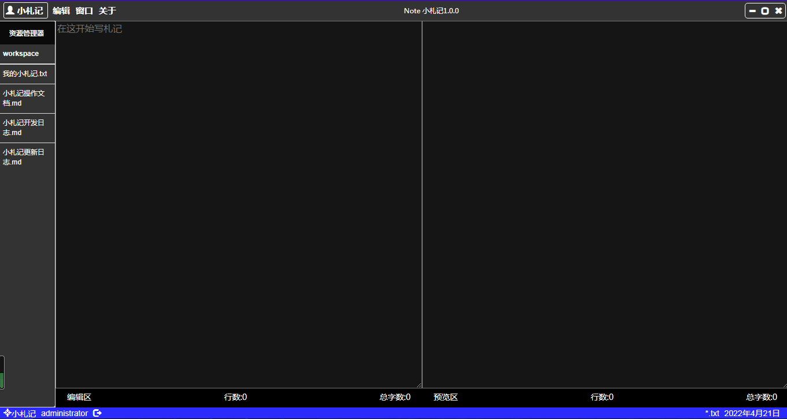
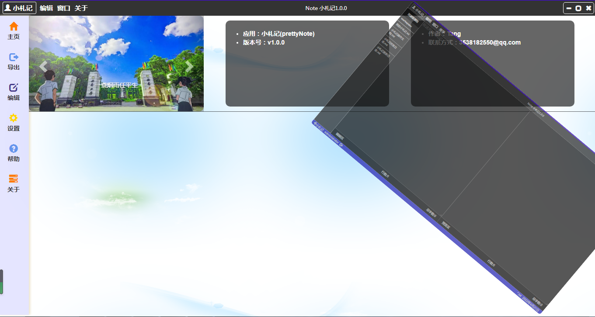

# 基于electron开发的编辑器--小札记
> 小札记社区版 prettyNotev1.0.0

## 软件介绍 profile
1. **小札记**是一款PC端编辑软件，基于electron开发，主要集成node.js,jquery.js,html+css+js
2. 详细开发过程请查看文件`./DEV_LOG.md
3. 当前版本，prettyNotev1.0.0，正在继续维护，敬请期待
4. 如有优化建议或开发需求，我诚挚希望您给我来邮件353-818-2550@qq.com
5. 如若使用本开源项目，请先在本地自定义安装electron+node.js依赖
```cpp
	//1. 下载安装electron: npm install electron -g
	//2. node官网：https://nodejs.org/en/
```

## 成果展示





## 项目地址

gitee: [https://gitee.com/TangGarlic/prettyNote.git](https://gitee.com/TangGarlic/prettyNote.git) 

github: [https://github.com/TonyTang-dev/prettyNote.git](https://github.com/TonyTang-dev/prettyNote.git)

## 操作说明

1. 运行软件，有资源管理器可以实时进行资源管理
2. 软件实现自定义操作栏，右上角实现最大/小化功能及关闭按钮，鼠标按住导航栏中部拖动可实现窗口拖动（注，由于使用js原生实现拖动，因此拖动容易导致丢失，当前请放慢拖动速度，最大化最小化当前也存在部分问题，兼容性不强，后续优化）
3. 左上角有软件logo及软件名**小札记**，点击此部分，顶层面板旋转弱化，进入底层操作面板，可进行相应操作
4. 点击操作面板左上角**小札记**部分或直接点击编辑面板可恢复到编辑面板
5. 进一步操作，正在开发中···

## 注意事项

1. 本软件是**小札记**社区版1.0.0，基于electron开发
2. 本项目已开源，可进行下拉二次开发
3. 本软件还存在若干bug，且软件开发未完毕，正在维护中···
4. 项目已开源，但拒绝任何形式的恶意利用和恶意开发
5. 本人声明，任何恶意的二次开发均与本人无关
6. 如有优化建议或开发需求，我诚挚希望您给我来邮件353-818-2550@qq.com